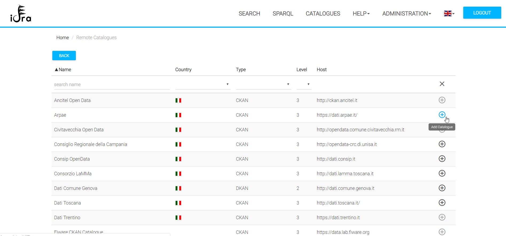
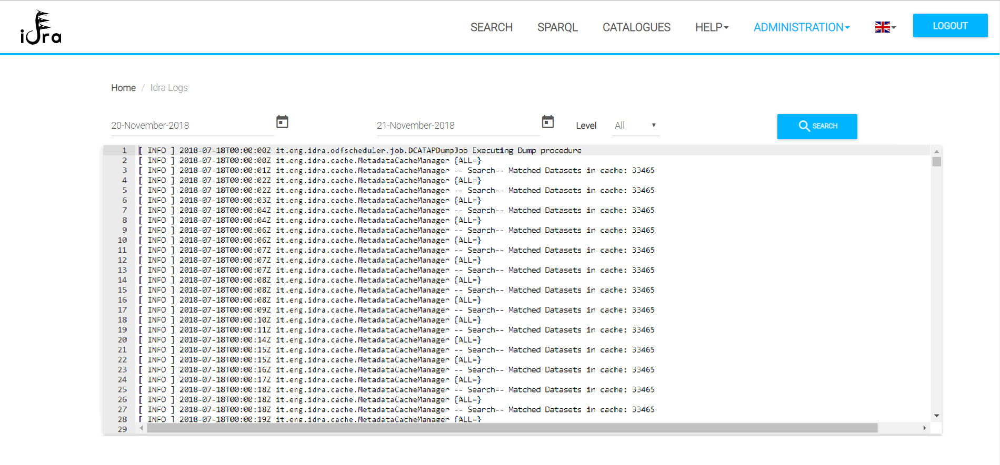

**Introduction**

This section provides the description of the Administration Functionalities. Through the Idra Portal a logged administrator can:

-	Manage ODMS Catalogues;
-	Manage configuration parameters;
-	Manage datalets;
-	View platform logs.

## Catalogues Management

In this page the administrator manages the Catalogues. In particular, he/she is able to:

- Add/Edit/Delete a Catalogue
- Add from a Remote Catalogues
- Activate/Deactivate a Catalogue;
- Start the synchronization of a Catalogue;
- Download a catalogue dump or the federation dump with DCAT-AP profile

The following pictures depicts the functionalities linked to every button or icons.

### Add a Catalogue

By clicking on the **ADD** button the following Catalogue form is presented to the administrator.

Here the administrator has to insert the metadata of the catalogue and then click on the **CREATE** button.
The default metadata related to a catalogue are:

- Name: The name of the catalogue.
- Publisher Name: The publisher name of the catalogue.
- Country: The country of the catalogue, if any.
- Category: The category of the catalogue (e.g. Municipality, Private institution).
- Description: A description of the catalogue.
- Homepage: The homepage of the catalogue.
- API Endpoint: The endpoint of its REST APIs, if any.
- Type: The type of the catalogue.
- Active: Through this field, if true the metadata of the datasets are retrieved from the catalogue; if false, the catalogue is federated but its datasets' metadata are not retrieved.
- Refresh: This parameter is used to set the synchronization period of the catalogue.

By selecting the type of a catalogue, the administrator may have to insert additional configuration parameters in order to federate it.
The available catalogues types that an administrator can create are:

- **CKAN**: this type of catalogue does not require any additional configuration parameters; 
- **DCATDUMP**: in order to federate this type of catalogue, the administrator has to provide a dump file or a dumpURL together with the specific DCAT Profile (e.g. DCAT-AP or DCAT-AP_IT); 
- **DKAN**: this type of catalogue does not require any additional configuration parameters;
- **ORION**: in order to federate the Fiware ORION Context Broker, additional configuration parameters are mandatory. If the ORION CB API endpoint requires authentication, the administrator has to insert the *client_id*, *client_secret* and the *oauth2Endpoint* in order to manage the OAUTH2 authentication and authorization flow. Moreover, the administrator has to upload a file with the datasets' metadata definition. Every distribution of each dataset must contain a valid ORION CB query and, optionally, the *Fiware-Service* and *Fiware-ServicePath* headers. 
- **SOCRATA**: this type of catalogue does not require any additional configuration parameters;
- **SPARQL**: in order to federate this type of catalogue, the administrator has to upload a file with the datasets' metadata definition. Every distribution of each dataset must contain a valid SPARLQ query and, optionally, an array of formats (e.g. csv,json,xml,etc...). 
- **WEB**: this type of catalogue retrieves the datasets' metadata by scraping a website. For this reason, it is required that the administrator adds a so called *sitemap* that contains the navigation parameters of the website and the mapping with DCAT-AP fields.
 
### Edit/Delete a Catalogue

By clicking on the **edit** icon on the Catalogue table, the user can edit most of the Catalogue's information. He/she cannot modify the *host* and *type* attributes. 

By clicking on the **delete** icon on the Catalogue table, the user deletes the Catalogue and its datasets from the federation. This operation cannot be reverted.

### Remote Catalogues

New Catalogues can be added to the federation using the **remote catalogues** list. This remote list is a catalogue repository maintained by Engineering. In the remote catalogue list an Idra administrator can find certified catalogues and by clicking on the *plus* icon he can insert the selected catalogue in his/her Idra instance.

### Activate/Deactivate a Catalogue

This functionality allows the administrator to manage on which catalogues the user can perform searches. Indeed, if a catalogue is **active** users will find its datasets during a search; if a catalogue is **inactive** user will not find any of its datasets during a search.

### Catalogue Synchronization

By default, Catalogues are automatically synchronized from the platform taking advantage of the *refresh period* attribute. If an administrator will force the synchronization of a catalogue he/she would have to click on its *synchronize* button.

### Download Dump

The administrator can download a DCAT-AP dump the Federated Open Data Catalogue. He/she can choose to download a single catalogue dump or the complete federation dump by clicking respectively on the download button in the catalogue's row of the table or on the global download button located at the bottom of the table.

## Configuration Parameters Management

An administrator can modify some of the configuration parameters that control the loading of the RDF files into the LOD repository. In particular, he/she can:

    - Enable RDF controls: if **false** all RDFs will be loaded into the LOD repository, if **true** only the RDFs which pass the controls will be loaded, the others will be discarded;
    - Enable RDF max size check: this configuration parameter if **true** will enable the controls on RDFs size;
    - RDF max dimension: if the previous configuration parameter is **true**, this parameter will represent the size limit of an RDF in order to be loaded into the repository. RDFs whose dimension exceeded will be discarded.
Moreover, the administrator will define the default catalogue's refresh period.

The administrator can also update his/her password and he/she can manage the RDFs' prefixes through the console.

## Datalets Management

Through this page, the administrator can manage all of the datalets produced by the end users.

The administrator will check the number of views and the last time the datalets was seen by end users. The administrator will be able to delete the datalet or to see its preview.

## Platform Logs

This page will show the *Logs* produced by the back-end server in the GUI. The administrator will be able to query the logs in order to search for a particular event. The following figure depicts this functionality.

