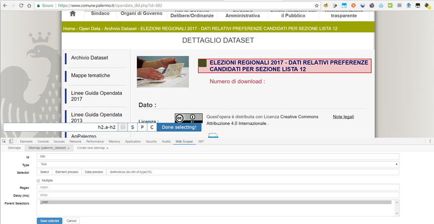
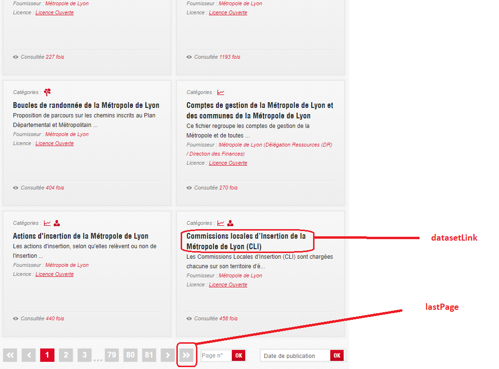
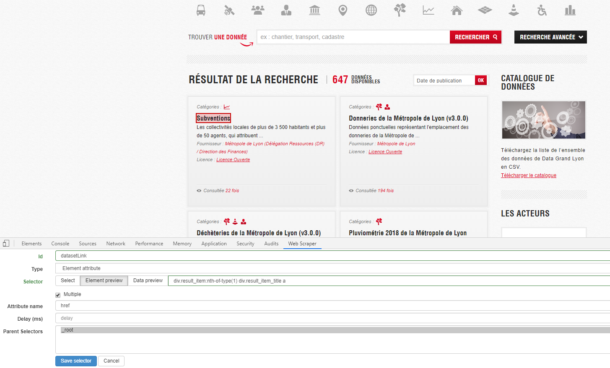
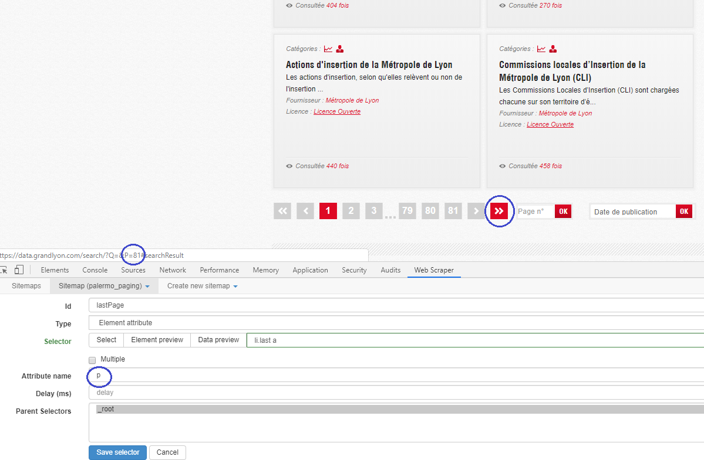
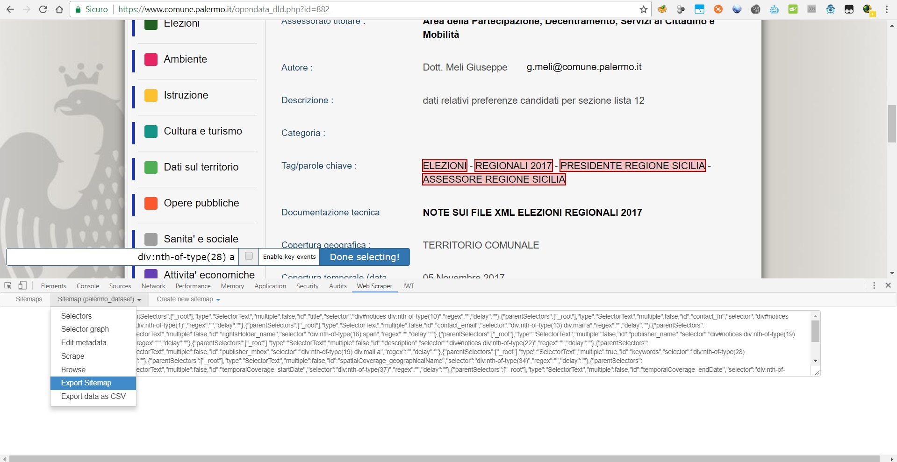
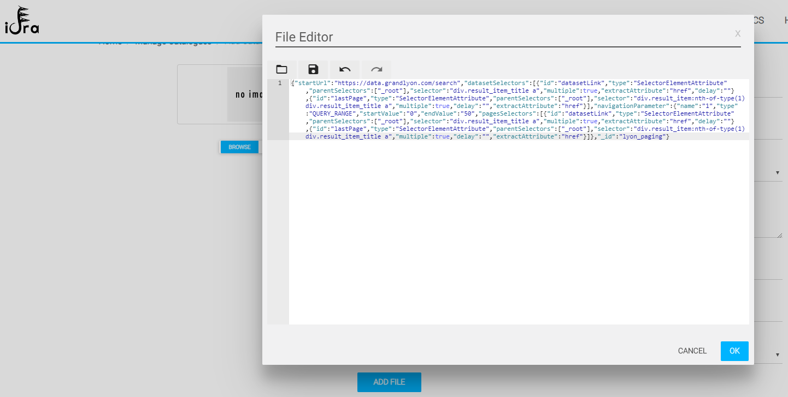

# Idra Scraping Guide

Idra supports the federation of a generic custom Open Data Catalogue (the **`WEB`** type) that provides the Open Datasets as web pages but doesn't expose any API to retrieve them in a programmatic way.
The Website must provide a page with the list of the links to the dataset pages or just only the URL for each dataset (e.g. with a Path or Query parameter in the URL that identifies the dataset).

Idra in this case can navigate, scrape all the dataset pages and map contained metadata in the DCAT-AP format. To do that, it requires to know how to navigate the site, and how to extract datasets metadata from the HTML elements of the page.
These information are defined in the so called **Sitemap**, which can be defined directly on the browser page, through the provided Web Scraper plugin for Chrome (see [here]() for installation instructions).

---

# Installing the Scraper Plugin
This Sitemap can be created through the provided browser plugin, which is a forked version ([here](https://github.com/OPSILab/web-scraper-chrome-extension)) of the [WebScraper.io](https://github.com/martinsbalodis/web-scraper-chrome-extension) plugin for Google Chrome.

In order to install the plugin, perform the following steps in the Chrome browser:

 - Clone the repository:
 `git clone https://github.com/OPSILab/web-scraper-chrome-extension.git`.
 - In Chrome, go to `chrome://extensions/` and check the box for **Developer mode** in the top right.
 - Click the **Load unpacked extension** button and select the folder cloned previously to install the plugin.
 - Press **F12** and then click on the **Web Scraper** tab.

##### Plugin Documentation

 - A video tutorial of the whole federation process can found [here]().
 - Since the main functionalities, such as the sitemap creation are basically the same of the original plugin, you can also see its [documentation](https://www.webscraper.io/documentation) and [video](https://www.youtube.com/watch?v=n7fob_XVsbY). 

---

# Federating a Web Open Data Catalogue

The Federation of such Open Data **Web** Catalog consists of the following steps:
1) Create the **Sitemap** through the browser plugin, defining the selectors to extract the metadata fields to be mapped with the DCAT-AP ones.
2) Insert the Sitemap metadata in order to define How to **navigate** the site.
2) Export the created Sitemap as JSON.
3) Import the JSON Sitemap in the "Add Catalogue" form.


# 1. Creating the Sitemap
The Sitemap will consist of a set of **Selectors**, which contain the information (CSS selectors) to extract from the HTML elements of the dataset page the data to be mapped to the DCAT-AP fields.
Please see the [DCAT-AP v1.1 specification](https://joinup.ec.europa.eu/solution/dcat-application-profile-data-portals-europe/distribution/dcat-ap-v11-pdf).

## Creating Selectors for the DCAT-AP fields

The Sitemap **MUST** contain at least the mandatory dataset Selectors, reported in the table below. Each selector will have a specific name as reported in the table and will represent a single dataset field to be extracted.

|              Selector name             | Mandatory | Cardinality |
|:--------------------------------------:|-----------|-------------|
| title                                  | Yes       | 1..n        |
| description                            | Yes       | 1..1        |
| publisher_name                         | No        | 0..1        |
| publisher_mbox                         | No        | 0..1        |
| publisher_homepage                     | No        | 0..1        |
| publisher_type                         | No        | 0..1        |
| publisher_identifier                   | No        | 0..1        |
| publisher_uri                          | No        | 0..1        |
| contact_fn                             | No        | 0..1        |
| contact_email                          | No        | 0..1        |
| contact_telephone                      | No        | 0..1        |
| contact_url                            | No        | 0..1        |
| keywords                               | No        | 0..n        |
| accessRights                           | No        | 0..1        |
| conformsTo_identifier                  | No        | 0..1        |
| conformsTo_title                       | No        | 0..1        |
| conformsTo_description                 | No        | 0..1        |
| conformsTo_referenceDocumentation      | No        | 0..1        |
| documentation                          | No        | 0..1        |
| frequency                              | No        | 0..1        |
| hasVersion                             | No        | 0..1        |
| isVersionOf                            | No        | 0..1        |
| landingPage                            | No        | 0..1        |
| language                               | No        | 0..1        |
| provenance                             | No        | 0..1        |
| releaseDate                            | No        | 0..1        |
| updateDate                             | No        | 0..1        |
| source                                 | No        | 0..1        |
| sample                                 | No        | 0..1        |
| spatialCoverage_geographicalIdentifier | No        | 0..1        |
| spatialCoverage_geographicalName       | No        | 0..1        |
| spatialCoverage_geometry               | No        | 0..1        |
| temporalCoverage_startDate             | No        | 0..1        |
| temporalCoverage_endDate               | No        | 0..1        |
| type                                   | No        | 0..1        |
| version                                | No        | 0..1        |
| versionNotes                           | No        | 0..1        |
| rightsHolder_name                      | No        | 0..1        |
| rightsHolder_mbox                      | No        | 0..1        |
| rightsHolder_homepage                  | No        | 0..1        |
| rightsHolder_type                      | No        | 0..1        |
| rightsHolder_uri                       | No        | 0..1        |
| rightsHolder_identifier                | No        | 0..1        |
| creator_name                           | No        | 0..1        |
| creator_mbox                           | No        | 0..1        |
| creator_homepage                       | No        | 0..1        |
| creator_type                           | No        | 0..1        |
| creator_uri                            | No        | 0..1        |
| creator_identifier                     | No        | 0..1        |
| subject                                | No        | 0..1        |
| theme                                  | No        | 0..n        |
| distribution_title                     | No        | 1..1        |
| distribution_license_uri               | No        | 0..1        |
| distribution_downloadURL               | Yes       | 1..1        |
| distribution_license_versionInfo       | No        | 0..1        |
| distribution_license_name              | No        | 0..1        |

> **Note:** The Distribution field is intended to be mandatory only if you want to create at least one Distribution, which is optionally.


In order to add new selectors:

 - Click on the **Sitemap** menu, then *Selectors*.
 - In the new tab, showing the current Sitemap Selectors, click on **Add new selectors**
 - As the Figure below depicts, select the HTML element to be extracted, by using the **Select** button, then click on the page element and finally on **Done Selecting**.
 



# 2. Inserting Sitemap metadata and navigation modes

The Idra Scraper supports the scraping of websites having two ways of navigating the dataset pages: **Range** and **Page**.

Depending on the navigation ways (Range or Page) and on the parameter types (Query or Path), the Navigation Parameters to be put in the **Edit Sitemap metadata** section (in the **Sitemap** menu) will vary.

## Navigation by Url Range

The dataset Urls have a parameter (e.g. "id") which values varies between a number range:

  - **Query** parameter: e.g. `www.example.com/datasets?id=0` to `www.example.com/datasets?id=50`
  In this case, put the following Navigation Parameters:
    - `Nav Param Name` : `id`
    - `Nav Param Type`:`QUERY RANGE`
    - `Nav Param Start`:`0`
    - `Nav Param End`:`50`
    - `Start URL`: `www.example.com/datasets`
    
The Idra Scraper will fetch all the dataset pages from `www.example.com/datasets?id=0` to `www.example.com/datasets?id=50`.
  
  - **Path** parameter: e.g. `www.example.com/datasets/id/0` to `www.example.com/datasets/id/50`. 
 In this case, put the following Navigation Parameters:
    - `Nav Param Name` : `id`
    - `Nav Param Type`:`PATH RANGE`
    - `Nav Param Start`:`0`
    - `Nav Param End`:`50`

The Idra Scraper will fetch all the dataset pages from `www.example.com/datasets/id/0` to `www.example.com/datasets/id/50`.

For each dataset page, it will extract the metadata fields of the single dataset, according to the dataset metadata selectors defined in the [**Defining dataset metadata selectors**]() section.

## Navigation by Pagination

The website has a paginated list of all the datasets. Each element in the list has the link to the single dataset page.
E.g. The [Data Grand Lyon portal](https://data.grandlyon.com/search/?Q=).

			 
In this case you have to:

 - 1) Define how to extract the **dataset links** from the list, by creating the specific **"datasetLink"** selector with type **Element Attribute** and `href` as **Attribute Name**. (see the Figure).
 
  
  > Ensure to select **ALL** dataset links (after clicking the second link, all the others will automatically highlight).
  > Ensure with **Data preview** that the link URL is extracted correctly.
 
 - 2) For the **pagination** you can either: 
     - Specify manually the pages number of the datasets list (in the **Nav Pages Number** field of **Edit Sitemap metadata** section).
	
     - Specify the dedicated **"lastPage"** selector in the Sitemap (see the section below), the Scraper will automatically extract the pages number from the specified "last page" element. 

 - 3) After defining the **"datasetLink"** selector and the pages number (by the **Nav Pages Number** metadata or by defining the **lastPage** selector), you must select the type and name of the pagination parameter, namely the parameter in the URL that will vary when navigating the list pages: 

    - **Query** parameter: 
      E.g. `https://data.grandlyon.com/search?P=10`.
	  In this case, put the following Navigation 
 Parameters:
      - `Nav Param Name` : `P`
      - `Nav Param Type`:`QUERY PAGE`
      - `Start URL`: `https://data.grandlyon.com/search`

    The Idra Scraper will fetch all the list pages from `https://data.grandlyon.com/search/?P=0` to `https://data.grandlyon.com/search/?P=81`. 	
 
    - **Path** parameter:
      E.g. `https://example.com/search/P/10`
In this case, put the following Navigation Parameters:
      - `Nav Param Name` : `P`
      - `Nav Param Type`:`PATH PAGE`
      - `Start URL`: `https://example.com/search`

  The Idra Scraper will fetch all the list pages from `https://data.grandlyon.com/search/P/0` to `https://data.grandlyon.com/search/P/81`.

For each page, it will extract all the dataset links using the **"datasetLink"** selector.
For each dataset link, it will go to the relative page, and then extract the metadata field of the single dataset (according to the dataset selectors defined in the ["Defining dataset metadata selectors"]() section).
	
>**Note.** The last page value (*81*), is thus the one retrieved either from the "Nav Pages Number" metadata field, or through the "LastPage" selector (as described in the example below).

>**Note.**. In this case, **Nav Param Name** represents the parameter used in the urls of the list **pages** (e.g. `https://data.grandlyon.com/search?P=10`), unlike the **Range** navigation case, in which the parameter represents directly the one used in the urls of the **datasets** (e.g. `www.example.com/datasets?id=0`).

### The LastPage selector	

If the list has an HTML element representing the last page of the paginated datasets list (e.g. a "last page" button as in the Figure), you can create the specific selector "lastPage" in the sitemap, by specifying how to extract the pages number value from a specific HTML element containing the number of pages (e.g. a "last page" button).

#### Example 
The last page element is an ">>" arrow that consists of the a HTML link element, as in the Figure below:
  
 
  ```
  <a href="https://data.grandlyon.com/search/?Q=&amp;P=81#searchResult"></a>
  ```

In this case, the selector to be defined will be:
    a) A selector with **"lastPage"** name and **"Element Attribute"** type, since we have to extract the `href` attribute from the `a`element. 
    b) Select the HTML element with the "Select" functionality (don't forget to click on **Done Selecting** after highlighting the element).
    c) Fill the **"Attribute name"** with `href`. 
    d) Ensure with **Data preview** that the link URL is extracted correctly.
	e) Save the selector.   	   
    
# 3. Export the Sitemap

Once all the DCAT-AP dataset selectors, Sitemap metadata and (in case of navigation by paginated list) **lastPage** and **datasetLink** selectors have been defined, you can export the Sitemap as JSON. Perform the following steps:
 - Click on **Sitemap** menu and then on **Export Sitemap**;
 - Copy the generated JSON text.



# 4. Import the Sitemap 

In the **Add Catalogue** form of the Idra **Catalogues Management** section, fill the required fields, in particular:
 - **API Endpoint**: must match with the one inserted in the **Start URL** Sitemap metadata;
 - **Type**: select **`WEB`**;
 - Click the **Update File** button and paste ion the File editor the text copied previously when exporting the Sitemap JSON.




	