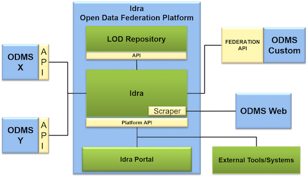

** Architecture Overview **

Idra provides access to resources of federated ODMSs from a single-entry point
through a set of APIs and is able to retrieve, search and visualize datasets
from different ODMSs. The platform is responsible for collecting metadata of
Open Data from federated ODMS catalogues and then for translating them into a
common and uniform format. In addition, it manages Linked Open Data (LOD),
importing them into a specific repository in order to perform queries on them.
The following picture illustrates the architecture of Idra.

Its main components are:

-   **Idra**: is the core of the platform that interacts with federated ODMS
    catalogues; it is responsible for managing internal federation processes. It
    provides the main functionalities through Platform API in order to be
    accessed by external application or by the Idra Portal. Main functionalities
    provided by the FM are: - ODMS catalogues management: registration, removal
    and monitor. - Federated full text search: possibility to search for
    specific Open Data on the federated ODMS catalogues. - Federated queries on
    Linked Open Data. - Federation configuration management

-   **LOD Repository**: is the central store in which collected Linked Open Data
    retrieved from federated ODMS catalogues are stored, in order to perform
    queries on them and to provide collected results in different formats.

-   **Idra Portal**: is a web application that allows end users to access Idra
    functionalities calling the Platform API. In particular, the Idra Portal
    allows to:
    -   Manage administrator authentication
    -   Search for Open Data/Linked Open Data, visualise and manage results
    -   Manage Federation and configuration.

Idra functionalities can be also accessed by a generic external system (e.g.
client application) using the Platform API. It is important to underline that
each ODMS catalogue depicted in the picture is a generic system that manages
OD/LOD. Usually it consists in a web portal associated to a database. In order
to be federated in Idra, the ODMS has to provide some basic functionalities
through RESTful APIs. One of the objectives of Idra is to allow the federation
of different ODMSs with minimum effort. Different type of ODMS catalogues will
be natively supported by Idra: CKAN, Socrata, DKAN or portals that provides the
datasets through a DCAT-AP or DCAT-AP_IT dump; Idra provides Federation API
Specification to allow “custom ODMS catalogues” to join the federation;
moreover, custom ODMS catalogues that does not provide APIs can join the
federation through the scraping of its web portal.

The following table shows the technologies currently supported by Idra:

| Connector | Supported version | Description |
| ------ | ------ |------ |
| CKAN |[API v3](https://docs.ckan.org/en/ckan-2.7.3/api/) | Connector for [CKAN](https://ckan.org/) portals |
| DCATDUMP | [DCAT_AP v1.1](https://joinup.ec.europa.eu/release/dcat-ap/11) ,  [DCAT-AP_IT v1.0](https://www.dati.gov.it/content/dcat-ap-it-v10-profilo-italiano-dcat-ap-0) | Connector to import metadata via dump file compliant with DCAT-AP or DCAT-AP_IT |
| DKAN | [DCAT Catalog endpoint](https://dkan.readthedocs.io/en/latest/apis/open-data.html) | Connector for [DKAN](https://getdkan.org/) portals |
| JUNAR | [API v2.0](https://junar.github.io/docs/en/_sections/01-index.html) | Connector for [Junar](http://www.junar.com/) portals |
| NATIVE | [API v1.0](https://idraopendata.docs.apiary.io/#reference/federation-api) | Connector for Idra Federation API |
| OPENDATASOFT | [Search API v2](https://help.opendatasoft.com/apis/ods-search-v2/#search-api-v2) | Connector for [OpenDataSoft](https://www.opendatasoft.com/) portals |
| ORION | [NGSI v2](https://swagger.lab.fiware.org/?url=https://raw.githubusercontent.com/Fiware/specifications/master/OpenAPI/ngsiv2/ngsiv2-openapi.json) | Connector that allows to create datasets with NGSI query-based distributions |
| SOCRATA | DCAT Catalog endpoint | Connector for [Socrata](https://socrata.com/) portals |
| SPARQL | [v1.1](https://www.w3.org/TR/sparql11-query/) | Connector that allows to create datasets with SPAQRL query-based distributions|
| SPOD | [CKAN API v1&2](https://docs.ckan.org/en/ckan-1.7.4/api-v2.html) | Connector for [Stat Portal Open Data](http://www.statportal.it/open-data) (SPOD)|
| WEB | v1.0 | Connector to import sitemaps in order to scrape and federate custom websites|
