## Metadata Search

Each user can perform a dataset. Two types of search are provided by the GUI:

-   Simple search
-   Advanced search.

### Simple search

To perform a simple search the user should click on the search icon to perform
the search on all of the federated datasets. The user could insert one or more
keyword into the search bar to perform a filtered search. Moreover, the user
could:

-   select a tag from the tag-cloud to filter the search using the selected tag;
-   search dataset by Categories.

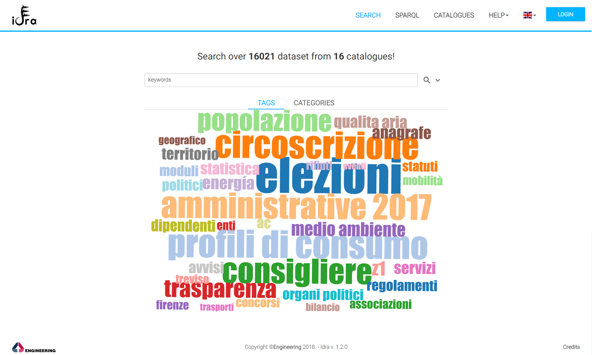

### Advanced Search

To perform an advanced search the user should click on the expand icon. An
advanced form appears to him/her where the user can fill one or all of the
fields in order to filter the results.

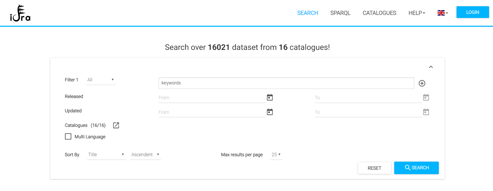

The advanced search functionality allows the user to search using a
multilanguage approach provided by the platform taking advantage of EuroVoc
thesaurus. The user should select one source language and one or more target
language to use this functionality. The following picture shows an example of
multilanguage search with keyword _water_, source language _English_ and target
language _Italian_.

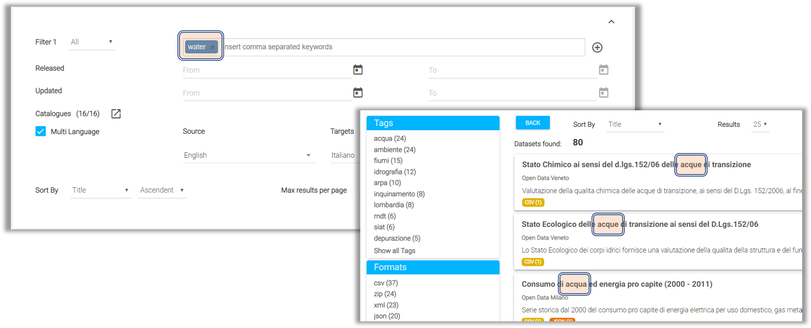

### Search Result

The result of both the simple search or the advanced search are a list of the
dataset that match with the requested filter. Next figure illustrates the result
of a search operation.

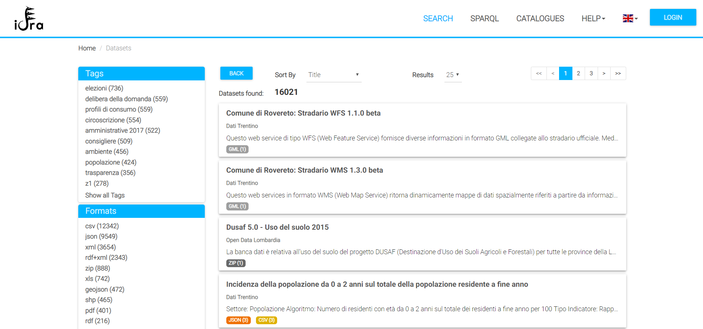

In this page the user can navigate results, they can change the order and the
number of the results per page; moreover, they can filter the data using a
_facet_ approach. Different facets are available, in particular:

-   Tags
-   File Formats
-   File Licenses
-   Catalogues
-   Categories

### Dataset Detail

By clicking on a dataset in the search result page, the detailed presentation of
all its metadata is showed to the user. The following picture shows an example
of dataset detail.

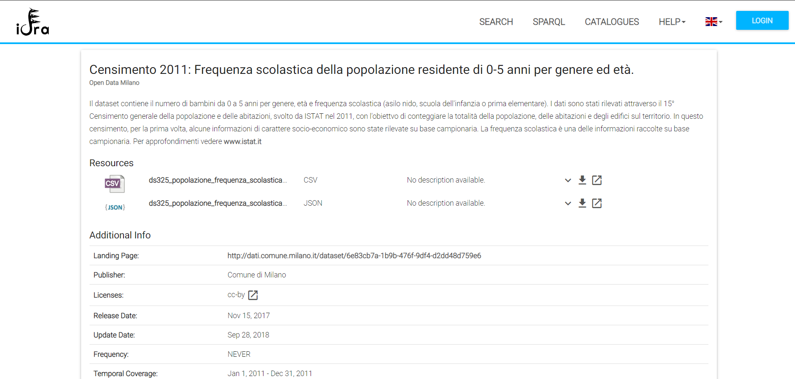

In this page the user can download the resources associated to the dataset by
clicking on the download button; moreover, the user can create a graphical
representation of the resources by clicking on the _create datalet_ button.

## Datalet Creation

A **Datalet** is a view WC, which is used to create rich, reusable visualization
of open data. It was developed under the
[ROUTE-TO-PA project](http://routetopa.eu/). The datalet creator tool called
_DatalEt-Ecosystem Provider (DEEP)_ was integrated with Idra in order to provide
to users an open data visualization tool. For any further references about
datalets please check
[https://github.com/routetopa/spod/wiki/Datalets](https://github.com/routetopa/spod/wiki/Datalets).

In order to create a datalet the user should follow this steps:

-   Select fields
-   Select the graphical representation

### Selecting fields

The datalet creation process starts with the selection of the fields from the
resource. In this page the user can add all or a subset of the original fields.
Moreover, the user can also filter the data through a dedicated panel. The user
should then click on the right arrow to continue the process.

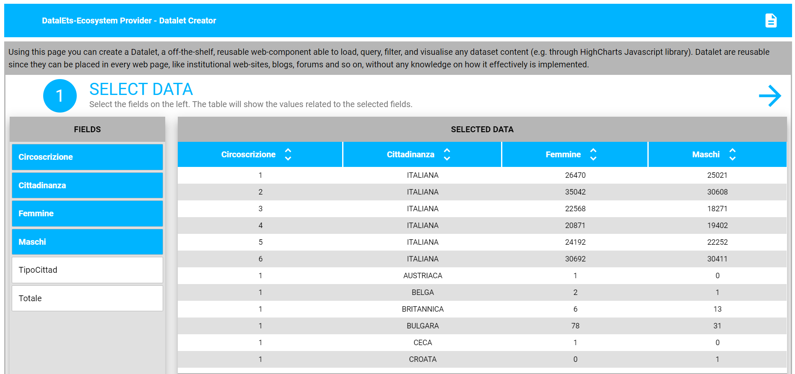

### Select the graphical representation

The next step is to choose the graphical representation of the selected fields
and the proper association among the selected fields and the chart inputs. The
following picture depicts a pie chart example.

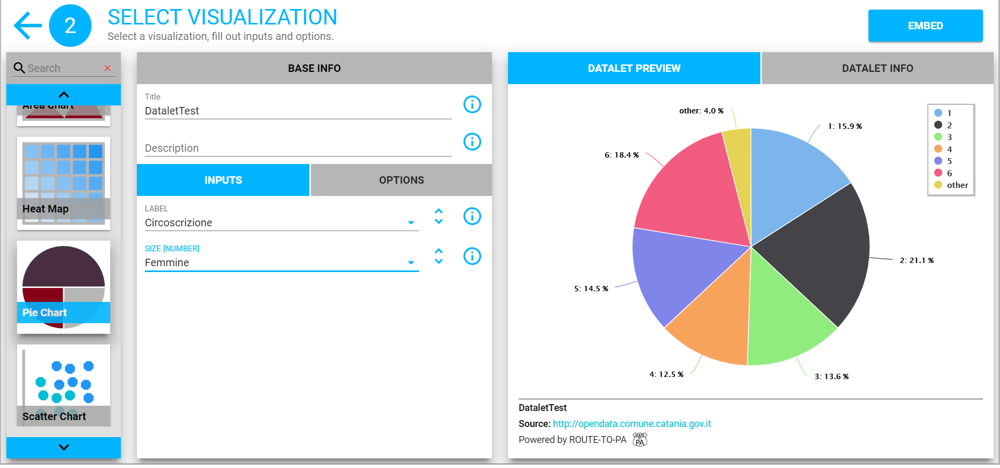

In order to show the datalet in the Idra environment the user should click on
the _Add_ button.

## SPARQL Queries

This functionality allows the user to search over LOD downloaded from the
federated dataset and stored into RDF4J triple store. In this page the user can
write his SPARQL query and select the format of the output between _XML_ or
_JSON_.

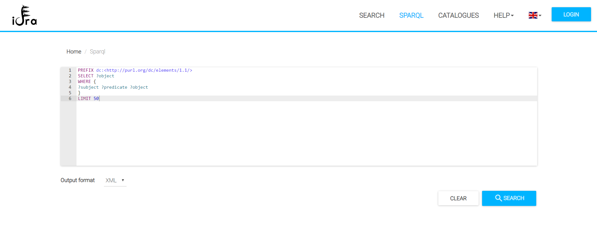

The result of the query is showed to the user and they can download.

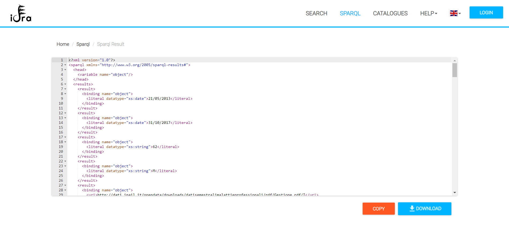

## Catalogues overview

In this page all of the federated Catalogues are showed to user. The user can
have a brief description of the Catalogue, check its country and category.
Moreover, by clicking on the search button, the user can see all of the its
datasets. The user can select between two views:

-   Card

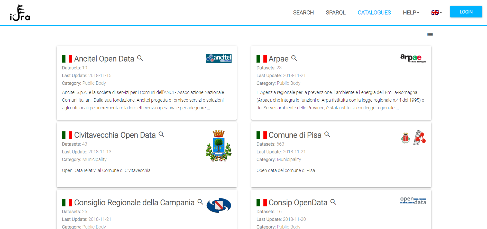

-   Table

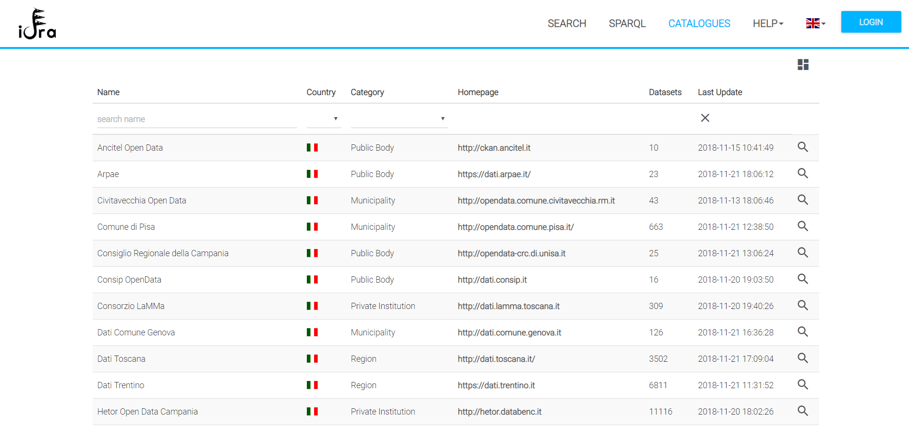
